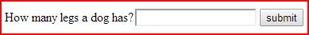
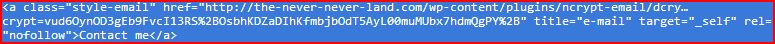
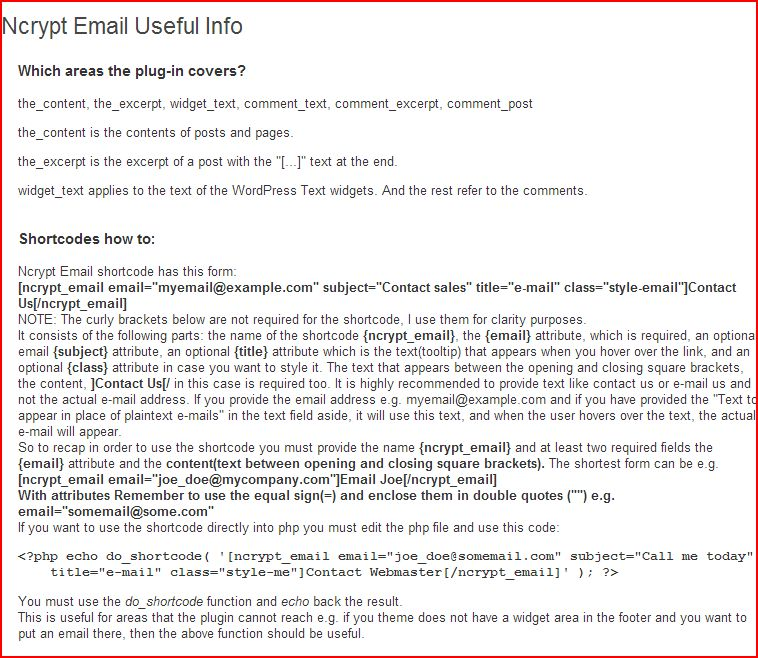

# Ncrypt Email

This plugin is based on mcrypt php library. Both the encryption and decryption occurs on the 

server. JavaScript is used (an AJAX Post Request) to dynamically contact the server, where the e-

mail decryption happens and send back the results. Regardless of how many e-mails are on a webpage 

only ONE AJAX request takes place. It utilizes the load event which means that only when the page 

is fully loaded the request – response happens (it will not slow down your page rendering). The 

actual display happens when you hover over the e-mail. Native JavaScript is used (no library 

dependencies). It is lightning fast and only 4 kb small.

## Major Functionality

* Encrypt and decrypt linked (mailto) e-mails and/or plaintext e-mails. You have the ability to 

activate and deactivate these choices. It has also shortcode functionality in case that you want 

to do it manually.
* Graceful degradation: Disabled JavaScript? No problem - if you click the e-mail link you will go 

to a page to fill in a question form. If you answer the question right the email will appear.  You 

have the ability to set your own question and answer.  This is great for browsers that do not 

support JavaScript (visually impaired people).
* For extra security the encrypter uses cookies - If cookies are disabled the e-mail(s) will not 

be revealed. According to [projecthoneypot website]

(http://www.projecthoneypot.org/how_to_avoid_spambots_4.php) “robots typically do not handle 

cookies. While it would be possible for spambots to deal with cookies as they traverse the web, it 

would add substantially to their overhead and, in turn, increase the costs to spammers stealing 

addresses. Again, we suggest that if a visitor to your site does not accept cookies you consider 

hiding the addresses displayed or restricting access to your contact page.”

### Manual -  How To

1. Requirements – Compatibility
    * This plugin is using php mcrypt library. Usually it comes with every php installation by 
default. It is a good idea to check if is installed, before you buy this plugin. You can check in 
your phpinfo() file if this extension exists/enabled. Alternatively ask your hosting provider.
    * The JavaScript file is loaded on the theme footer; so the theme must have the wp_footer() 
template tag in the appropriate place. Usually all themes have.
    * It is compatible with php 4.0.5 and onward.
    * It is compatible with wordpress 2.8 and onward.

2. Browser Testing:
    * Chrome
    * Firefox 23.0.1 and onward for windows
    * Opera 12.16 for windows and onward
    * Safari 5.1.7 for windows and onward..* iOS 4.3.3 iPhone, iOS 4.3.3 and onward
    * iPad, iOS 4.3.3 iPod Touch 
    * Oracle VM VirtualBox Manager IE6 – WinXP, IE7 – Vista, IE8 – WinXP, IE8 - Win7, IE9 - Win7, 
IE10 - Win7, IE11 - Win7.

3. Installation
Upon downloading the package, you will have an ncrypt-email folder inside of it. Upload this to 
your plugins folder by going to the admin menu: go to 'Plugins -> Add New -> Upload’ and choose 
the ncrypt-email.zip file. When the upload has been complete press activate plugin. NOTE: if you 
still have problems installing it check the detailed installation instructions, from the official 
WordPress site: read the [standard installation procedure for WordPress plugins](https://codex.wordpress.org/Managing_Plugins#Installing_Plugins).
4. Configuration: On the Settings menu click on Ncrypt Email. You will go to this page:
This page is divided into two main sections the Ncrypt Email Configuration and the Ncrypt Email 
Useful Info (see last section).

    1. Ncrypt Email Configuration Section: The first option "Encrypt mailto: links" is pretty strait 
forward; it will encrypt all e-mails that appear as hyperlinks on the web page e.g. [Contact me](mailto:contact_me@mail.com). So the Contact me hyperlink text will remain unchanged but behind the scenes will become something like this: 
 
The e-mail address has been encrypted.

    2. The second option “Encrypt plaintext e-mails” will find all the plain text e-mails (like someone@somemail.com) on a web page: These e-mails can be between 
 tags (paragraphs)  
tags, plain text (no tags) and generally any non-anchor <a > tags. After it finds the e-mails it 
will turn them into hyper-linked e-mails. They become [email-me](mailto:someone@somemail.mal). 
    3. Now what happened to the someone@somemail.com text? The answer is option number three: “Text 
to appear in place of plaintext e-mails”? The text (someone@somemail.com) that appears on the 
screen, is it protected? The answer is NO and that is why it is ask you to provide this text… “It 
is highly recommended to provide it. If you don’t, proper encryption cannot occur. The e-mail is 
still susceptible to OCR (Optical Character Recognition) attacks. When the user hovers over the 
text, the actual e-mail will appear.” It is asking you to provide text (the default is “e-mail 
me”) which will replace the e-mail address text with this. But when the use hovers over the e-mail 
link the actual e-mail will be revealed. So in our previous example the (someone@somemail.com) 
text, will become someone@somemail.com. And when the user hovers over the link it will turn into 
someone@somemail.com which is both clickable and/or you can copy and paste it if you want. 
And it continues: “The same text will appear in a mailto e-mail, if it has text in the form of 
e.g. myemail@example.com . Again when the user hovers over the text, the actual e-mail will 
appear”. So the purpose of the third option is to hide/camouflage the e-mails that appear on the 
screen, not only the plaintext but also the linked e-mails. Two things to note here, it is not 
obligatory to provide the text but as I mentioned above proper encryption cannot occur. And 
second, the fact that the text changes from e-mail me (or any text you provide) to the actual e-
mail address might cause some minor issues with the layout e.g (push the text a bit further to the 
right). Usually is not an issue but I thought you might want to know.
    4. The fourth option asks if you want to provide a “Class attribute (name) for the generated 
plaintext e-mail links. In case you want to style them using css.” I think it is self explanatory 
if you are a web designer – developer. If not either ask one or leave this option blank (the 
default).
    5. The fifth option says “Question for non-JavaScript-capable browsers.” If a browser does not 
support JavaScript (either because is JS is disabled or is a screen reader or an rss reader etc), 
when the user clicks on an e-mail link, a web page will appear with the following question:
   

Upon the submission of the correct answer the email address will appear:
   

You can either click on it and launch your default e-mail handler or copy and paste it. The 
question and answer scheme is great for visually impaired people and even the most smart spambots 
are not able to answer it.
    6. The sixth option gives you the ability to set the answer of the above question.
    7. The seventh option says: “For extra protection the encrypter sets a cookie. Most if not all of 
spam bots do not have the capability to support cookies. So in case that browser cookies are 
disabled by the user, a message will appear.” According to projecthoneypot website: “robots 
typically do not handle cookies. While it would be possible for spambots to deal with cookies as 
they traverse the web, it would add substantially to their overhead and, in turn, increase the 
costs to spammers stealing addresses. Again, we suggest that if a visitor to your site does not 
accept cookies you consider hiding the addresses displayed or restricting access to your contact 
page.” The default message is: “You need to enable cookies to view this email! Enable Cookies and 
refresh the page!” Again you can set you own message. There are two cases, the first is when 
cookies are disabled but JavaScript is enabled. The user will get a JavaScript alert box with the 
above mentioned message:

When I hovered over the Contact me link this alert message appeared. Of course the code is still in “raw” form:

The e-mail address has not been revealed yet. If the user presses ok to close to alert box and clicks on the link it will go to this web page:
 A page with the same message.
The second case is when if both JavaScript and cookies are disabled. In this case, when the user 
clicks the link, the above mentioned web page will appear.
    8. The final option is about hyperlinked emails that have some text like. By default if you hover 
over these emails the address will appear e.g. (conctact@contactmail.all). If you don’t want that, 
just uncheck the default option.
5. Ncrypt Email Useful info:

   
I think this section is very descriptive on its own. It deals with two things: 1st the WordPress 
areas this plugin covers, which are: the_content, the_excerpt, widget_text, comment_text, 
comment_excerpt, comment_post. 2nd how to use Ncrypt shortcodes. I have to mention here that you 
can deactivate (uncheck) both the 1st and 2nd options and utilize only the shortcode 
functionality. And also sortcodes are useful in areas that the plugin does not cover and you need 
to put an e-mail address there. Note that it might require editing a php file like the example 
that I mention above.
6. PHP Files: There are four php files ncrypt-email.php, dcrypt-email.php, ncrypt-email-options-
page and index.php.
7. JavaScript file: There is one JavaScript file: ncrypt_js_min.js and it is located in the 
directory called javascript.
8. Language Directory: There is a language directory with the English US translation.
## Versioning
2.3 
## Authors
* **Efthyvoulos Tsouderos** - *Initial work* - [e01t](https://github.com/E01T)
## License
This project is licensed under the [GNU General Public License](https://www.gnu.org/licenses/license-list.html#GPLCompatibleLicenses) v2, or any later version
